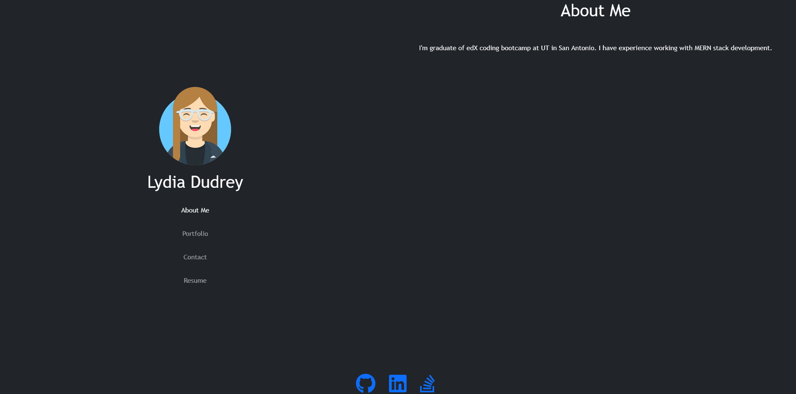
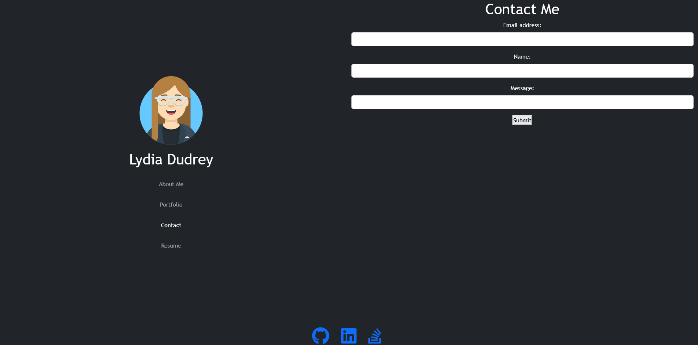
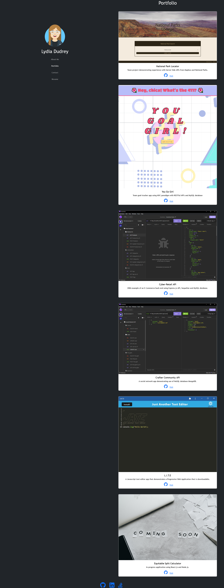

# Lydia's Portfolio v2

  ## Description
 Welcome to version 2 of my personal Portfolio! This version is built using React.js and Bootstrap for the front end design.
 
  ## Table of Contents
  
  - [Usage](#usage)
  - [Features](#features)
  - [Contributing](#contributing)
  - [Questions](#questions)
  

  ## Usage
  * Link to the live website
  https://ldudrey.github.io/portfolio-v2/

  ## Features
 My Portfolio comes with the following pages:

 * About Me: It has a little description of myself.
  

 * Contact Me: Leave your name, email and a message to get in touch.
  

 * Portfolio: List of the top 6 projects in my github repository.
  

 * Resume: Downloadable link to my Resume.
  
 
 On the bottom of everypage is a footer that has icon links to my Github Repo, LinkedIn profile and Stackoverflow profile. 

  ## Contributing
  
  No contribution to this repo
   
  ## Questions
  
  Any questions please contact me at: ladudrey@gmail.com. 
  More examples of my work are available at [GitHub](https://github.com/LDudrey).